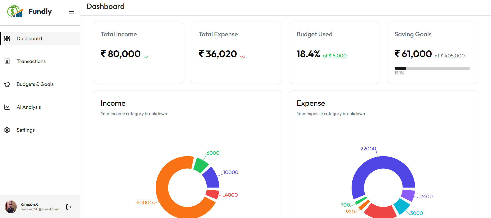
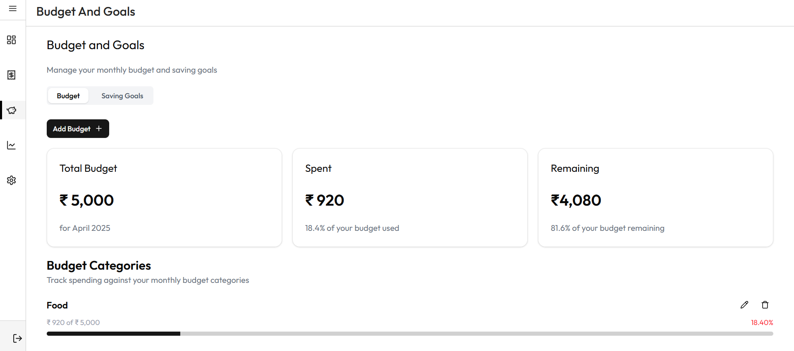
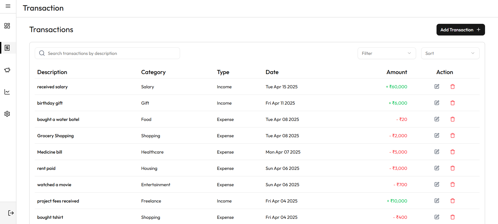
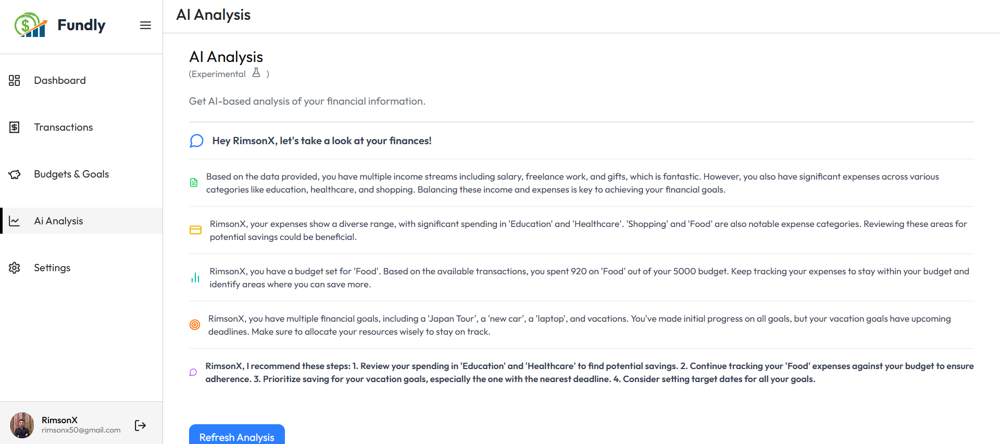

# Fundly 💸

Fundly is a personal finance management web application that helps users take control of their finances. With powerful features like transaction tracking, budget planning, goal setting, and AI-powered financial insights, Fundly makes it easy to stay on top of your money.

## 🚀 Features

- **Save & Manage Transactions**  
  Add, edit, delete, and view all your income and expenses in one place.

- **Set & Track Budgets**  
  Create monthly budgets to monitor spending and stay financially disciplined.

- **Define Financial Goals**  
  Set savings or investment goals and track progress over time.

- **AI-Powered Insights**  
  Get personalized, data-driven insights on your spending habits and financial health.

## 📸 Preview

  
  
  


## 🛠️ Tech Stack

- **Frontend**: React, Tailwind CSS, React Router, Zustand, TanStack Query
- **Backend**: Node.js, Express, PostgreSQL, Prisma
- **AI Integration**: Gemini API
- **Others**: Vite, Axios, Render, Vercel

## 🧠 AI Insights

Fundly uses AI to provide helpful tips based on your transaction patterns. Examples:

- Suggestions to optimize spending
- Budget improvement tips
- Warnings on unusual expenses

## 📦 Installation

### 1. Clone the repository

```bash
git clone https://github.com/thisMeSandeep/fundly.git
```
